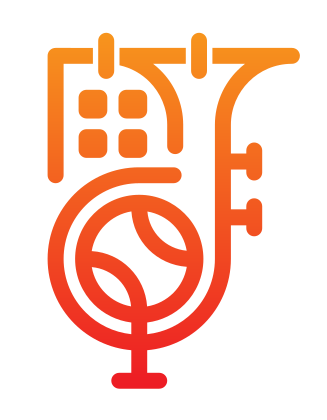

<div align="center">
  
  <h1>Club Manager</h1>
  <p>A comprehensive Laravel-based application for managing club operations, events, members, and communications.</p>
  
  [](https://opensource.org/licenses/MIT)
  [](https://laravel.com)
  [](https://www.php.net)
</div>

---

## 🚀 Features

### 📅 Event Management
- **Event Calendar** - Visual calendar view with event overview
- **Event Types** - Categorize events with custom types
- **Event Statistics** - Track attendance and participation
- **iCalendar Export** - Export events to calendar applications
- **JSON/Excel/CSV Export** - Export event data in multiple formats

### 👥 Member Management
- **Member Directory** - Comprehensive member database
- **Member Groups** - Organize members into groups
- **Member Import** - Bulk import members from external sources
- **Member Statistics** - Analyze member data and trends

### 📊 Attendance Tracking
- **Attendance Recording** - Track member attendance at events
- **Attendance Polls** - Create polls for event participation
- **Public Poll Links** - Share polls with members via public URLs
- **Attendance Statistics** - Generate reports and analytics

### 📰 News & Communications
- **News Management** - Create and publish news articles
- **Web Push Notifications** - Send real-time notifications to members
- **Email Notifications** - Automated email communication system

### 💰 Sponsoring & Contracts
- **Contract Management** - Manage sponsoring contracts
- **Sponsor Tracking** - Keep track of sponsors and agreements

### 🔐 User Management & Security
- **Role-Based Permissions** - Fine-grained access control system
- **Multi-Factor Authentication** - OAuth integration (Google, Authentik)
- **User Permissions** - Customizable permission system
- **Welcome Notifications** - Automated onboarding for new users

### ⚙️ Configuration & Settings
- **System Configuration** - Flexible configuration management
- **Multi-Language Support** - Currently supports German (extensible)
- **File Management** - Upload and manage files with access control
- **Backup System** - Automated backup functionality (via Spatie Backup)

### 🛠️ Technical Features
- **Livewire Components** - Modern, reactive UI components
- **Responsive Design** - Mobile-friendly interface built with Tailwind CSS
- **RESTful API** - JSON API for integrations
- **Task Scheduler** - Automated background jobs
- **Error Tracking** - Sentry integration for error monitoring

---

## 📋 Requirements

- Docker & Docker Compose
- PHP 8.1 or higher (for local development without Docker)
- Composer (for initial setup)
- Node.js & NPM (for asset compilation)

---

## 🚀 Quick Start

### Using Docker (Recommended)

For detailed setup instructions, deployment guides, and Docker configuration, see the **[Docker Documentation](./docker/README.md)**.

#### Development Setup

```bash
# Clone the repository
git clone https://github.com/danielraab/club-manager.git
cd club-manager

# Copy environment file
cp .env.example .env

# Configure user permissions
echo "WWWUSER=$(id -u)" >> .env
echo "WWWGROUP=$(id -g)" >> .env

# Install dependencies
docker run --rm \
    -u "$(id -u):$(id -g)" \
    -v "$(pwd):/var/www/html" \
    -w /var/www/html \
    laravelsail/php83-composer:latest \
    composer install --ignore-platform-reqs

# Start the application
export SAIL_FILES=docker/development/docker-compose.yml
./vendor/bin/sail up -d

# Setup the application
./vendor/bin/sail artisan key:generate
./vendor/bin/sail artisan migrate --seed
./vendor/bin/sail artisan storage:link
./vendor/bin/sail artisan webpush:vapid
./vendor/bin/sail npm install
./vendor/bin/sail npm run dev
```

The application will be available at `http://localhost` (or configured `APP_PORT`).

#### Production Deployment

Production setup uses pre-built Docker images from GitHub Container Registry. See the **[Docker Production Guide](./docker/README.md#production-environment)** for complete deployment instructions.

---

## 📚 Documentation

- **[Docker Setup & Deployment](./docker/README.md)** - Complete Docker documentation for development and production
- **[Development Environment](./docker/README.md#development-environment)** - Laravel Sail setup and development workflow
- **[Production Deployment](./docker/README.md#production-environment)** - Production Docker configuration and deployment

---

## 🧪 Testing & Code Quality

### Run Tests
```bash
./vendor/bin/sail test
```

### Code Style (Laravel Pint)
```bash
# Check code style
./vendor/bin/sail pint --test -vvv

# Fix code style
./vendor/bin/sail pint
```

---

## 🔧 Common Commands

```bash
# Create admin user
./vendor/bin/sail artisan app:register-admin-user

# Run migrations
./vendor/bin/sail artisan migrate

# Seed database
./vendor/bin/sail artisan db:seed

# Clear caches
./vendor/bin/sail artisan cache:clear
./vendor/bin/sail artisan config:clear
./vendor/bin/sail artisan route:clear
./vendor/bin/sail artisan view:clear

# Run scheduled tasks manually
./vendor/bin/sail artisan schedule:test
```

---

## 🤝 Contributing

Contributions are welcome! Please feel free to submit a Pull Request.

1. Fork the repository
2. Create your feature branch (`git checkout -b feature/AmazingFeature`)
3. Commit your changes (`git commit -m 'Add some AmazingFeature'`)
4. Push to the branch (`git push origin feature/AmazingFeature`)
5. Open a Pull Request

---

## 📝 License

This project is licensed under the MIT License - see the [LICENSE](LICENSE) file for details.

---

## 🙏 Acknowledgments

Built with:
- [Laravel](https://laravel.com) - The PHP Framework for Web Artisans
- [Livewire](https://livewire.laravel.com) - A full-stack framework for Laravel
- [Tailwind CSS](https://tailwindcss.com) - A utility-first CSS framework
- [Alpine.js](https://alpinejs.dev) - A rugged, minimal framework for composing JavaScript behavior

---

## 📧 Support

For issues, questions, or contributions, please use the [GitHub Issues](https://github.com/danielraab/club-manager/issues) page.

